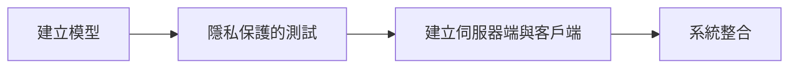

# Sphinx_Implement

## 摘要

一個附有保有隱私的捲積神經網路訓練與辨識系統。
結合了同態加密和差分隱私技術，在無需信任任何第三方的情況下實現模型的快速訓練和推斷，保護用戶數據隱私。

**key word: 隱私保護、線上學習、同態加密、差分隱私、深度學習**

## 使用技術
- 同態加密 (Homomorphic Encryption，以下簡稱HE)
- 差分隱私 (Differential Privacy，以下簡稱DP)
- 卷積神經網路(Convolutional Neural Network，以下簡稱CNN)

## 預計進行方式

## 目前進度 - 60/100
- [x] CNN model (C++)
- [x] HE 練習 & 使用
- [x] 建立 Server & Client
- [x] Server & Client 明文溝通
- [ ] 部署CNN models至Server & Client
    - [ ] 使用明文
        - [ ] Forward_pass
            - [x] Convolution Layer
            - [x] send Sigmoid & recv Sigmoid
            - [x] MaxPooling Layer
            - [ ] Dense Layer
                - [ ] Dense_Sum
                - [ ] send Dense_Sigmoid & recv Dense_Sigmoid
            - [ ] Dense Layer 2
                - [ ] Dense_Sum 2
                - [ ] send Dense_Sigmoid 2 & recv Dense_Sigmoid 2
            - [ ] send Softmax Output & recv Softmax Output
            - [ ] Update_Weights
    - [ ] 使用密文
## TO FIX
location: client 553
sigmoid 轉換出來會有nan跟-nan

